# Maestro Testing Documentation

Testing the complete Maestro orchestration workflow with a **Task Tracker CLI** project.

## Test Project

**Goal**: Build a task tracker CLI with:
- Commands: add, list, complete, delete tasks
- Storage: JSON file persistence (~/.tasks.json)
- Output: Colored terminal output with status indicators
- Validation: Input validation with helpful error messages
- Tests: Unit tests for core functions

**Requirements**:
- Node.js with ES modules (no dependencies)
- Unix CLI conventions (exit codes, stderr for errors)
- Include a --help flag

## Maestro Commands Being Tested

| Step | Command | Purpose | Status |
|------|---------|---------|--------|
| 1 | `/maestro-plan --log=detailed` | Decompose goal into atomic tasks | ✅ Done |
| 2 | `/maestro-challenge` | Cross-tool critique of plan | ✅ Done |
| 3 | `/maestro-run` | Execute tasks with quality gates | ✅ Done |
| 4 | `/maestro-review` | Cross-tool code review | ⏭️ Skipped |
| 5 | `/maestro-status` | Check orchestration progress | ✅ Done |
| 6 | `/maestro-report` | Generate execution summary | ✅ Done |

## Screenshots

### 1. Plan Phase - AAVSR Validation
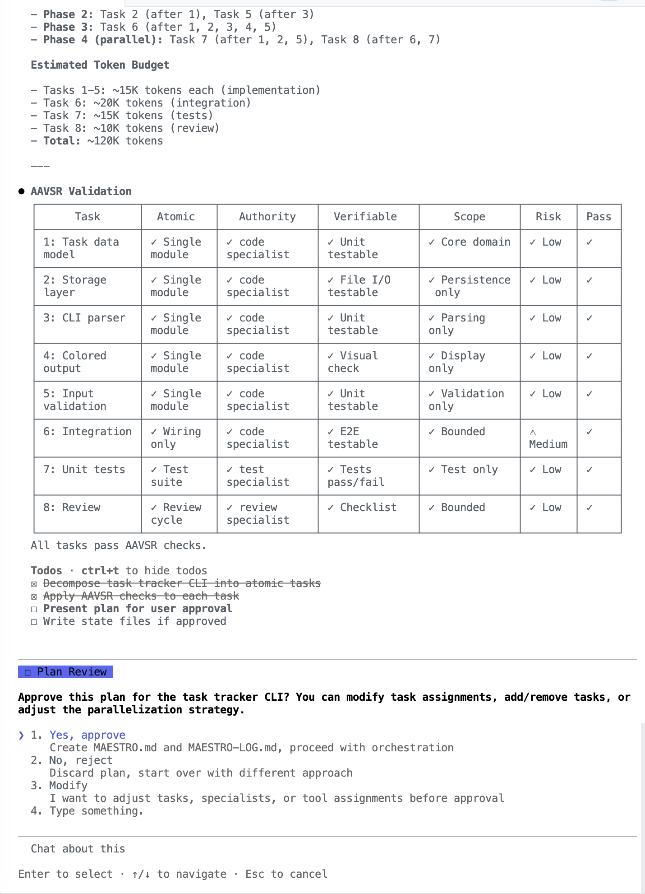

**Key observations**:
- 8 tasks identified with proper dependencies
- All tasks pass AAVSR validation (Atomic, Authority, Verifiable, Scope, Risk)
- Estimated ~120K tokens total
- Parallelization strategy: Phase 4 runs Task 7 and Task 8 in parallel

### 2. Challenge Phase - Dispatch to Gemini
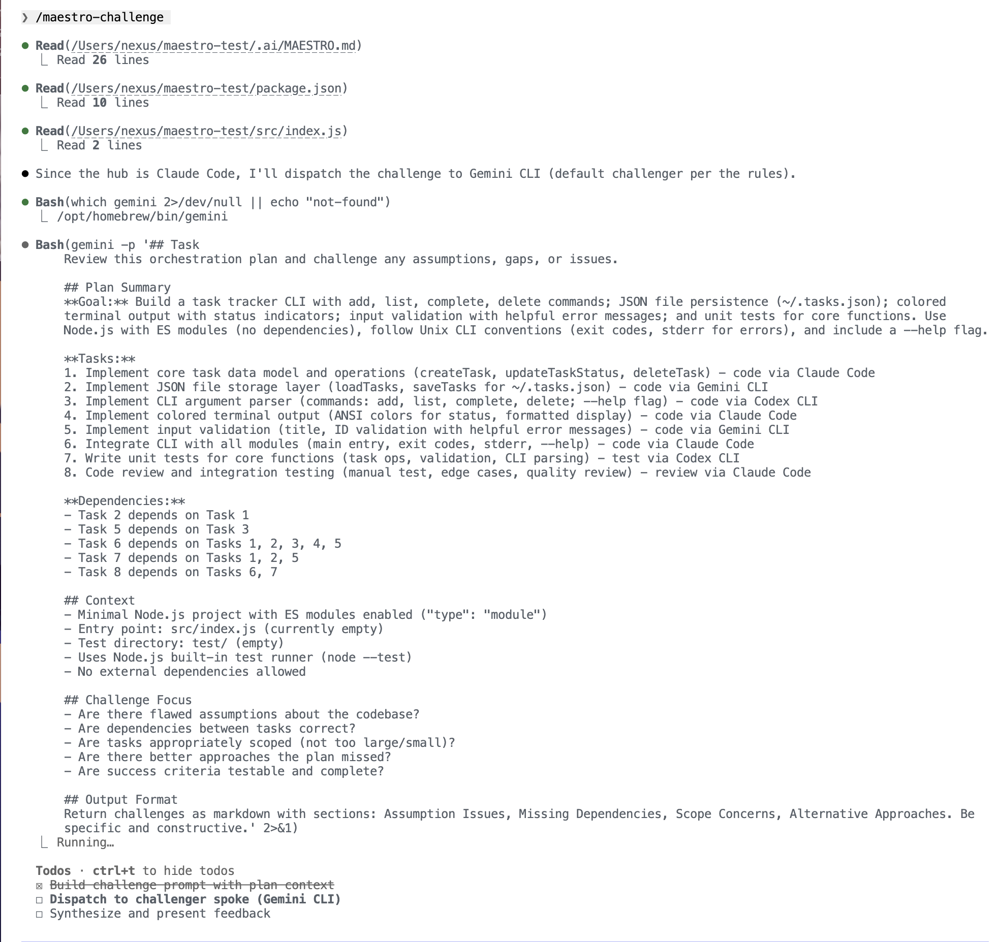

**Key observations**:
- Hub (Claude Code) dispatches to Gemini CLI as challenger (cross-tool validation)
- Reads state from `.ai/MAESTRO.md` + project context (`package.json`, `src/index.js`)
- Sends structured challenge prompt with:
  - Plan summary and full task list
  - Dependencies between tasks
  - Project context (Node.js, ES modules, no deps)
  - Challenge focus areas (assumptions, dependencies, scope, alternatives)
- Gemini asked to return feedback in 4 categories: Assumption Issues, Missing Dependencies, Scope Concerns, Alternative Approaches

**Tool assignment distribution**:
- Tasks 1, 4, 6, 8: Claude Code
- Tasks 2, 5: Gemini CLI
- Tasks 3, 7: Codex CLI

### 3. Challenge Phase - Gemini Feedback
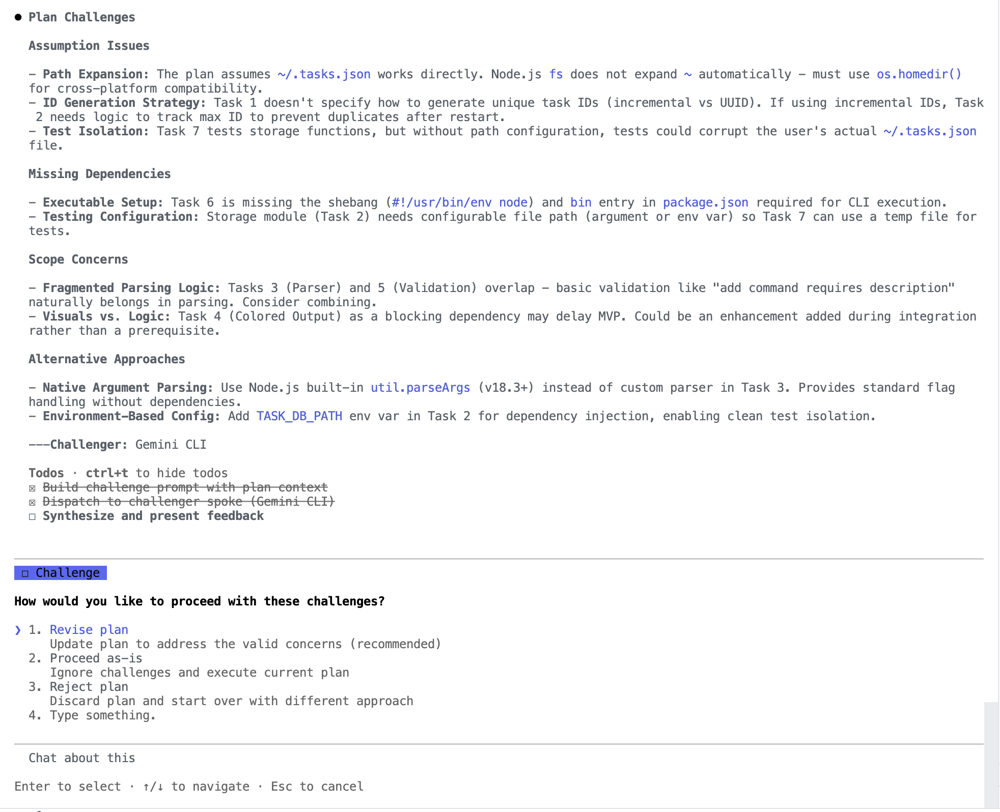

**Gemini CLI returned structured challenges in 4 categories:**

| Category | Issue | Recommendation |
|----------|-------|----------------|
| **Assumption Issues** | Path `~/.tasks.json` won't expand | Use `os.homedir()` for cross-platform |
| | ID generation strategy unspecified | Track max ID to prevent duplicates |
| | Test isolation risk | Tests could corrupt user's actual file |
| **Missing Dependencies** | Task 6 missing shebang | Add `#!/usr/bin/env node` + `bin` in package.json |
| | No test file path config | Task 2 needs configurable path (arg or env var) |
| **Scope Concerns** | Tasks 3 & 5 overlap | Parser and validation could combine |
| | Task 4 may delay MVP | Colored output could be added during integration |
| **Alternative Approaches** | Custom CLI parser | Use Node.js `util.parseArgs` (v18.3+) |
| | Hardcoded file path | Add `TASK_DB_PATH` env var for test isolation |

**User options presented**:
1. ✅ **Revise plan** (recommended) - Update plan to address valid concerns
2. Proceed as-is - Ignore challenges
3. Reject plan - Start over with different approach
4. Type something - Custom input

### 4. Challenge Phase - Revised Plan


**Plan updated based on Gemini's feedback:**

| ID | Description | Tool | Depends |
|----|-------------|------|---------|
| 1 | Core task data model (id via timestamp+random, pure functions) | Claude Code | - |
| 2 | JSON storage (os.homedir(), TASK_DB_PATH env var) | Gemini CLI | 1 |
| 3 | CLI parser + validation (util.parseArgs, inline validation) | Codex CLI | - |
| 4 | Colored terminal output module | Claude Code | - |
| 5 | CLI integration (shebang, bin entry, wire all modules) | Claude Code | 1,2,3,4 |
| 6 | Unit tests (using TASK_DB_PATH for isolation) | Codex CLI | 1,2,3 |
| 7 | Code review and integration testing | Claude Code | 5,6 |

**Key Changes (8 → 7 tasks)**:
- ✅ Merged validation into parser (Tasks 3+5 → Task 3)
- ✅ Combined review tasks (Tasks 7+8 → Task 7)
- ✅ Added `os.homedir()` for proper path expansion
- ✅ Added `TASK_DB_PATH` env var for test isolation
- ✅ Added shebang and `bin` entry for proper CLI setup
- ✅ Using `util.parseArgs` instead of custom parser

**Next step**: Run `/maestro-run` to begin execution.

---

## Run Phase Documentation

### 5. Run Phase - Start & Phase 1 Parallel Execution
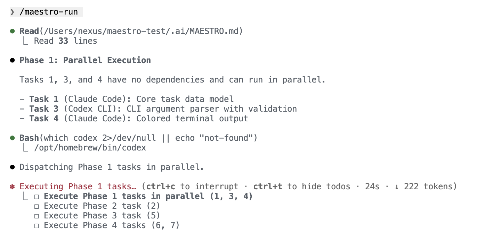

**Maestro identifies parallelizable tasks:**
- Tasks 1, 3, and 4 have no dependencies → can run in parallel
- Execution plan: Phase 1 (1,3,4) → Phase 2 (2) → Phase 3 (5) → Phase 4 (6,7)

### 6-8. Run Phase - Task Dispatches
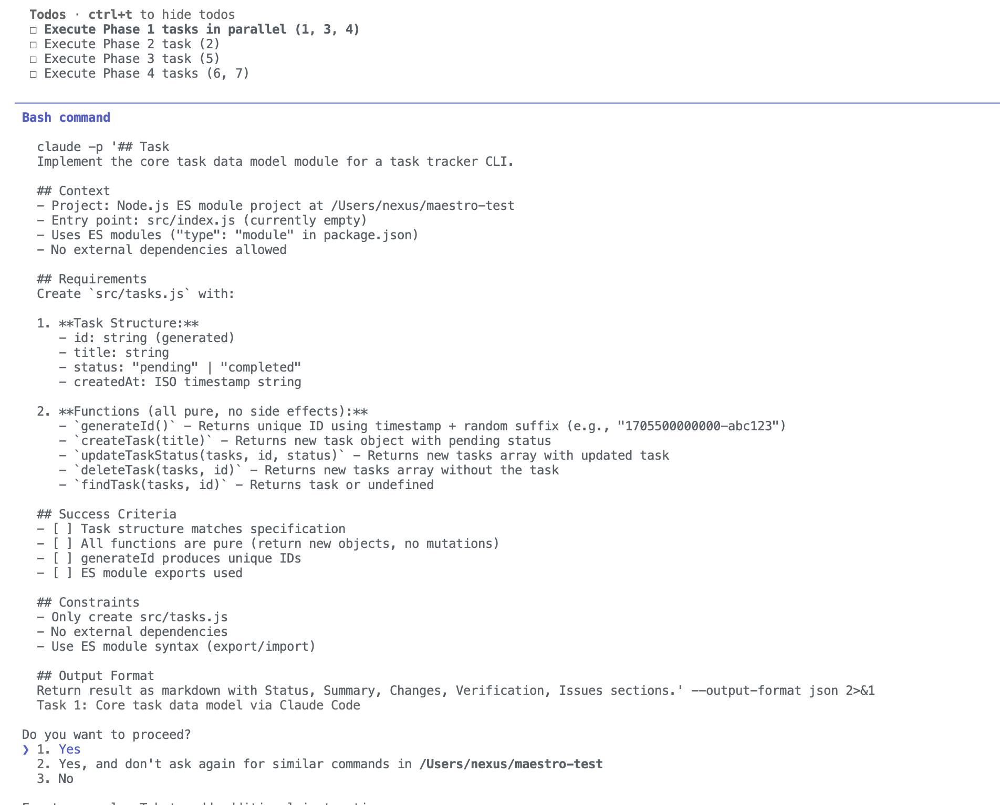
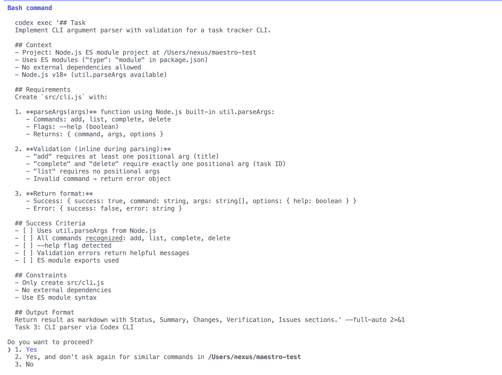
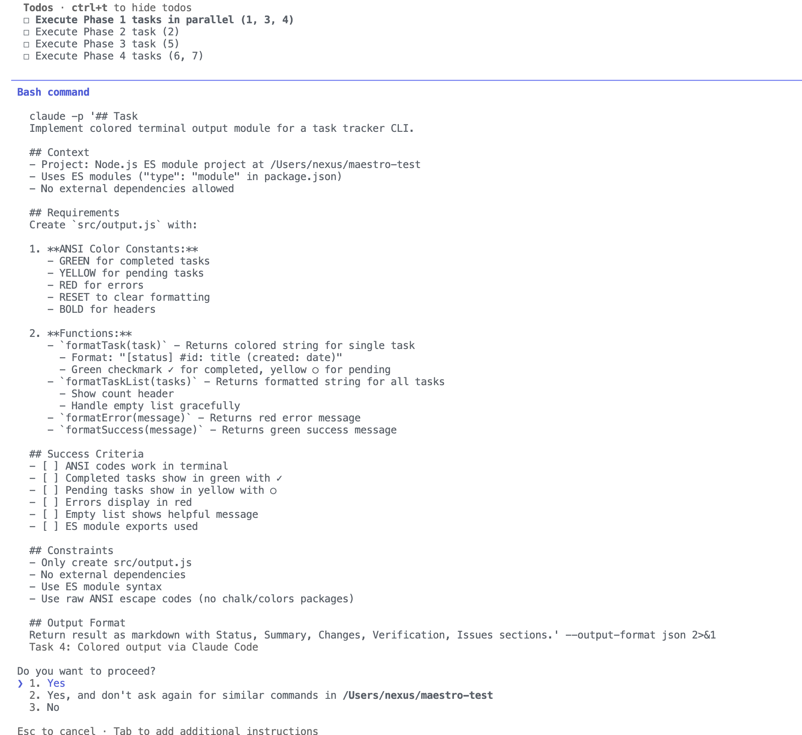

**Parallel dispatches to different tools:**

| Task | Tool | Handoff Content |
|------|------|-----------------|
| 1 | Claude Code | Core task data model (generateId, createTask, updateTaskStatus, deleteTask, findTask) |
| 3 | Codex CLI | CLI argument parser using `util.parseArgs` with validation |
| 4 | Claude Code | Colored terminal output (ANSI codes for status indicators) |

Each handoff includes: Context, Requirements, Success Criteria, Constraints, Output Format.

### 9. Run Phase - Permission Recovery
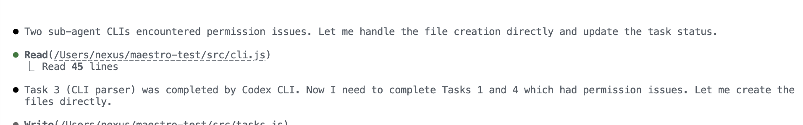

**Graceful degradation when spokes can't write files:**
- Two sub-agent CLIs (Claude Code, Codex CLI) encountered permission issues
- Task 3 completed by Codex CLI successfully
- Hub handles Tasks 1 and 4 directly (fallback behavior)

### 10-12. Run Phase - Phase 2 (Storage Layer)
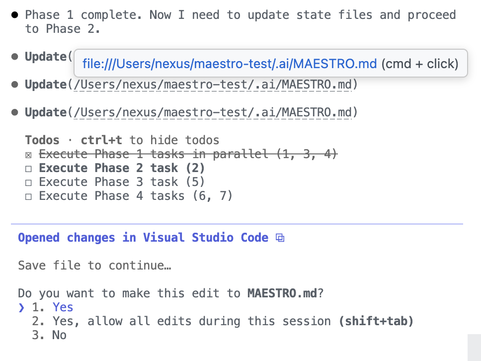
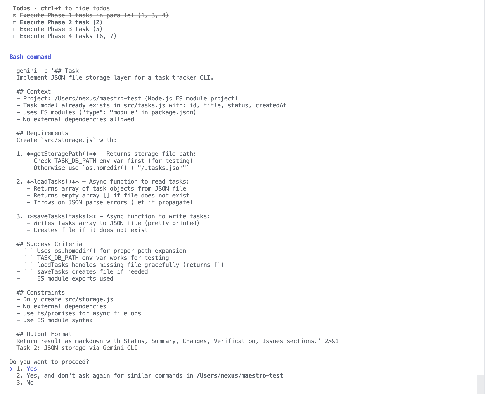
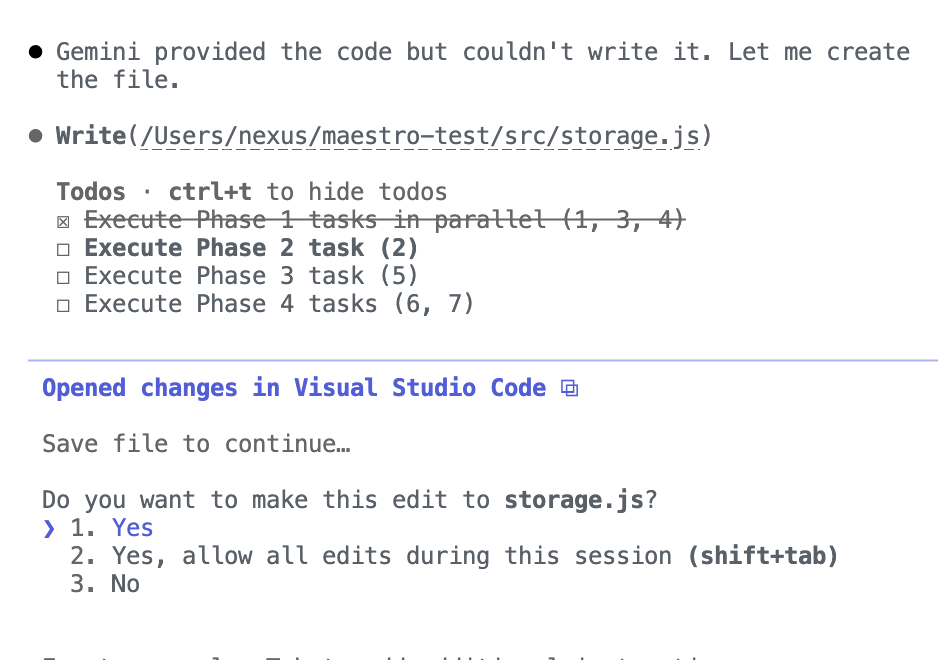

**Task 2 dispatched to Gemini CLI:**
- JSON file storage layer with `os.homedir()` for path expansion
- `TASK_DB_PATH` env var support for test isolation
- Functions: `getStoragePath()`, `loadTasks()`, `saveTasks()`
- Gemini provided code but couldn't write → Hub creates `storage.js` directly

### 13. Run Phase - Phase 3 (Integration)
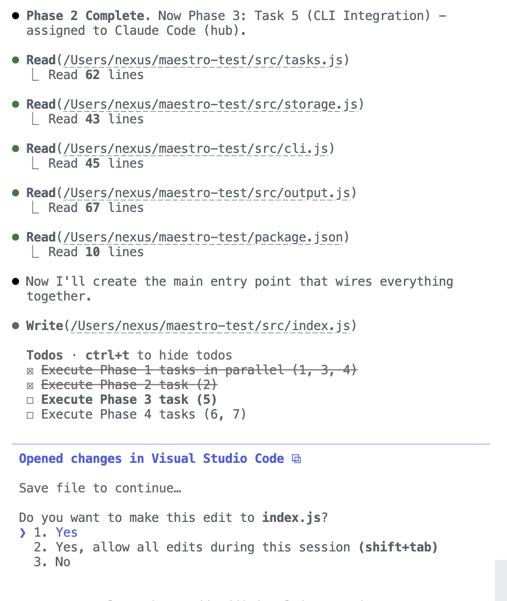

**Task 5: CLI Integration**
- Reads all source files (tasks.js, cli.js, storage.js, output.js, package.json)
- Creates main entry point `src/index.js` with shebang
- Wires all modules together

### 14-16. Run Phase - Phase 4 (Tests)
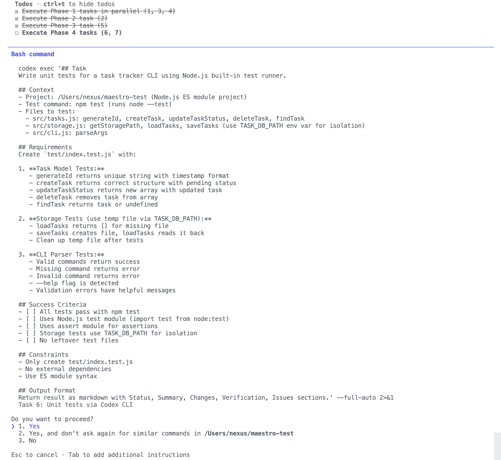
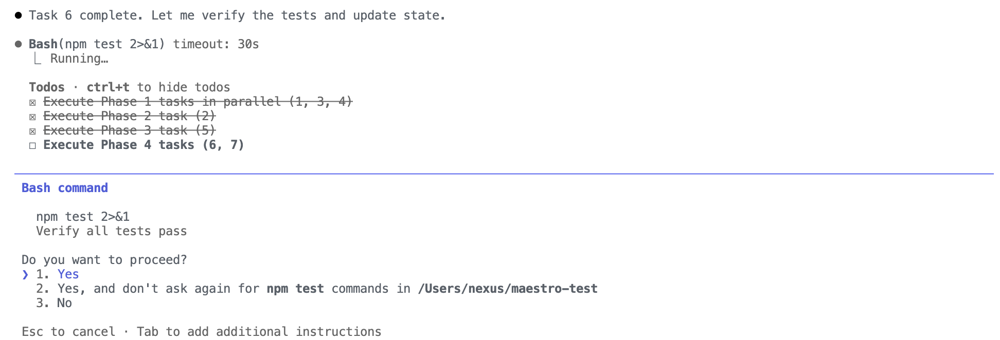
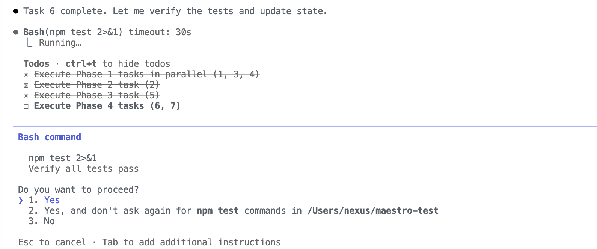

**Task 6: Unit tests via Codex CLI**
- Uses Node.js built-in test runner (`node --test`)
- Tests for: Task model, Storage (with `TASK_DB_PATH` isolation), CLI parser
- After completion: runs `npm test` to verify all pass

### 17-19. Run Phase - Task 7 (Review & Bug Fix)
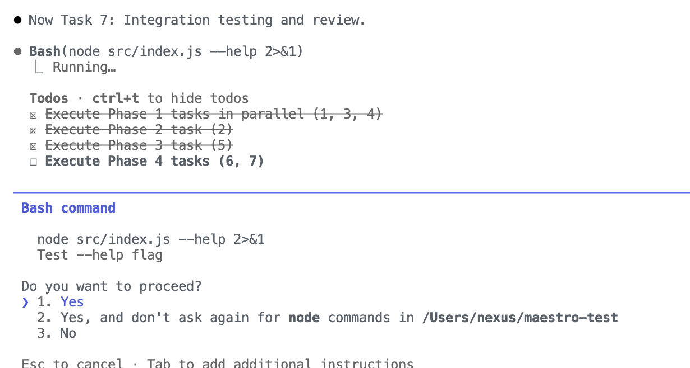
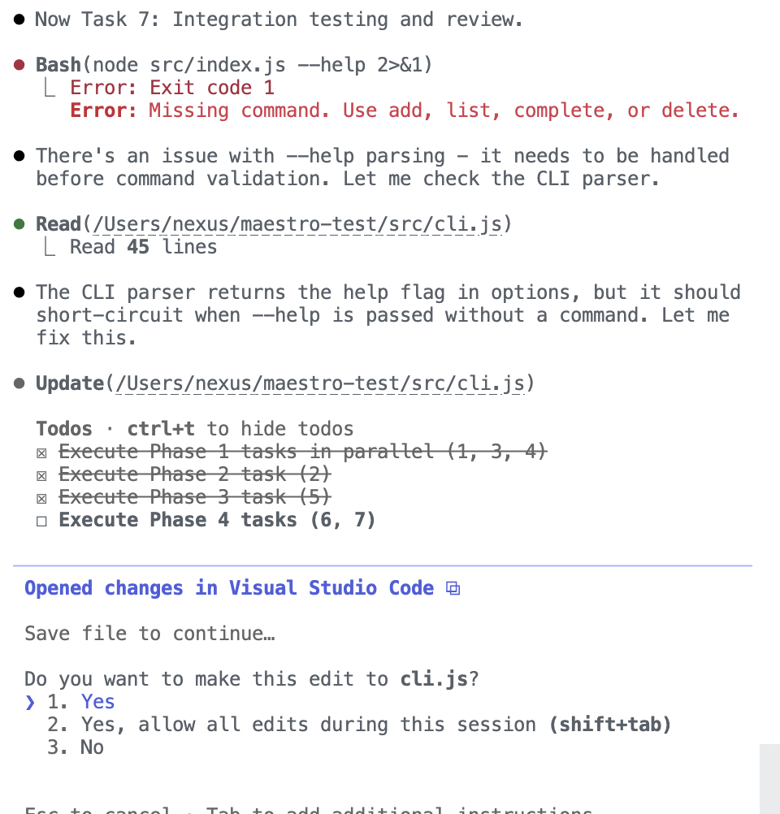
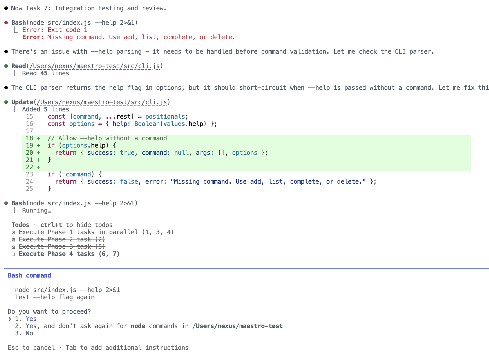

**Task 7: Integration testing discovered a bug!**
- Testing `--help` flag: `node src/index.js --help`
- **Bug found**: `--help` without a command returned error instead of help text
- **Fix applied**: Added check to short-circuit when `--help` is passed without a command
- Re-tested to confirm fix works

### 20. Run Phase - Orchestration Complete


**Final Results:**

| Task | Description | Tool | Status |
|------|-------------|------|--------|
| 1 | Core task data model | Claude Code | ✓ |
| 2 | JSON file storage | Gemini CLI | ✓ |
| 3 | CLI argument parser | Codex CLI | ✓ |
| 4 | Colored terminal output | Claude Code | ✓ |
| 5 | CLI integration | Claude Code | ✓ |
| 6 | Unit tests | Codex CLI | ✓ |
| 7 | Code review | Claude Code | ✓ |

**Files Created:**
```
src/
├── index.js    # Main entry with shebang
├── tasks.js    # Task data model (pure functions)
├── storage.js  # JSON persistence (~/.tasks.json)
├── cli.js      # Argument parser (util.parseArgs)
└── output.js   # Colored terminal output

test/
└── index.test.js  # 14 unit tests
```

**Test Results:** 14 tests pass with `npm test`

**Execution Time:** 18m 7s

**Usage:**
```bash
node src/index.js --help
node src/index.js add "Buy groceries"
node src/index.js list
node src/index.js complete <id>
node src/index.js delete <id>
```

---

## Report Phase Documentation

### 21. Maestro Report
📄 [Full Report](./21-maestro-report.md)

The `/maestro-report` command generates a comprehensive narrative from the execution log (`.ai/MAESTRO-LOG.md`).

**Report Highlights:**

| Metric | Value |
|--------|-------|
| Total Tasks | 7/7 completed |
| Total Dispatches | 9 |
| Total Tokens | ~27K |
| Parallel Tasks | 3 (Phase 1) |
| Bugs Found & Fixed | 1 |
| Unit Tests | 14 passing |
| Lines of Code | 460 total |

**Token Usage by Tool:**
| Tool | Dispatches | Tokens |
|------|------------|--------|
| Claude Code | 5 | ~10K |
| Gemini CLI | 2 | ~4K |
| Codex CLI | 2 | ~13K |

**Key Recommendations from Report:**
1. Consider `--dangerously-skip-permissions` for trusted automation (sub-agents couldn't write files)
2. Always run `/maestro-challenge` — it caught 7 significant issues
3. Parallel execution worked well (3 tasks in Phase 1)
4. Add integration tests to the test suite for CI/CD

---

## Status Phase Documentation

### 22. Maestro Status
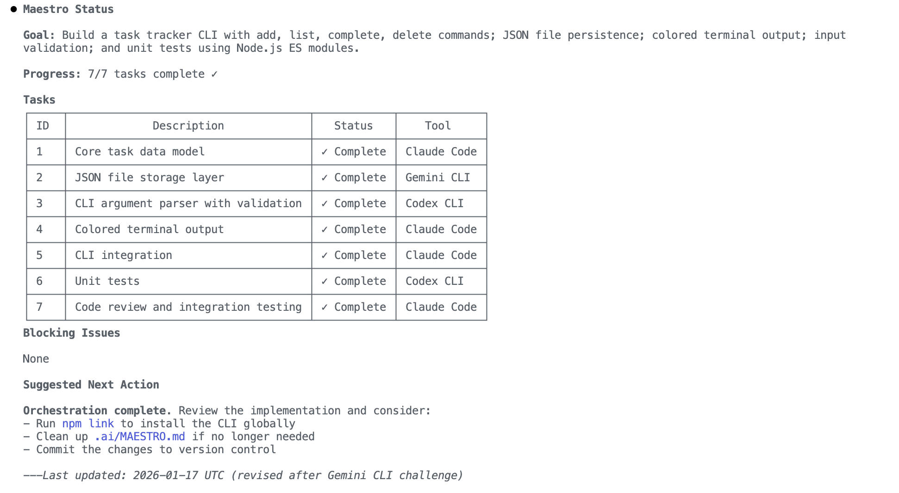

The `/maestro-status` command displays the current orchestration state.

**Status Output:**
- **Goal**: Build a task tracker CLI...
- **Progress**: 7/7 tasks complete ✓

| ID | Description | Status | Tool |
|----|-------------|--------|------|
| 1 | Core task data model | ✓ Complete | Claude Code |
| 2 | JSON file storage layer | ✓ Complete | Gemini CLI |
| 3 | CLI argument parser with validation | ✓ Complete | Codex CLI |
| 4 | Colored terminal output | ✓ Complete | Claude Code |
| 5 | CLI integration | ✓ Complete | Claude Code |
| 6 | Unit tests | ✓ Complete | Codex CLI |
| 7 | Code review and integration testing | ✓ Complete | Claude Code |

**Blocking Issues:** None

**Suggested Next Action:**
- Run `npm link` to install the CLI globally
- Clean up `.ai/MAESTRO.md` if no longer needed
- Commit the changes to version control

*Last updated: 2026-01-17 UTC (revised after Gemini CLI challenge)*

---

## Task Breakdown from Plan

| Task | Atomic | Authority | Verifiable | Scope | Risk |
|------|--------|-----------|------------|-------|------|
| 1: Task data model | Single module | code specialist | Unit testable | Core domain | Low |
| 2: Storage layer | Single module | code specialist | File I/O testable | Persistence only | Low |
| 3: CLI parser | Single module | code specialist | Unit testable | Parsing only | Low |
| 4: Colored output | Single module | code specialist | Visual check | Display only | Low |
| 5: Input validation | Single module | code specialist | Unit testable | Validation only | Low |
| 6: Integration | Wiring only | code specialist | E2E testable | Bounded | Medium |
| 7: Unit tests | Test suite | test specialist | Tests pass/fail | Test only | Low |
| 8: Review | Review cycle | review specialist | Checklist | Bounded | Low |

## Execution Phases

- **Phase 1**: Task 1 (data model - foundation)
- **Phase 2**: Task 2 (after 1), Task 5 (after 3)
- **Phase 3**: Task 6 (after 1, 2, 3, 4, 5)
- **Phase 4 (parallel)**: Task 7 (after 1, 2, 5), Task 8 (after 6, 7)
